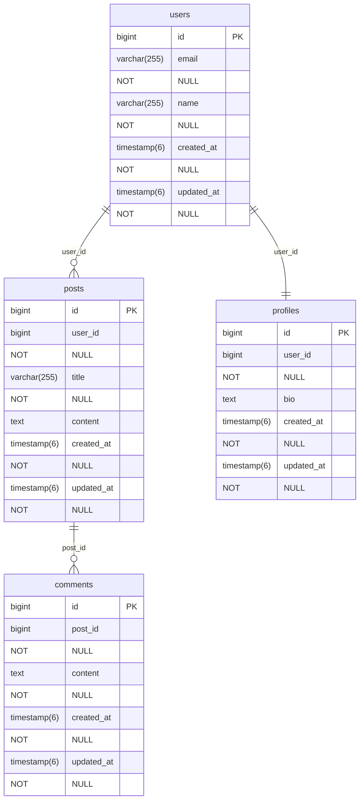

# Rails Mermaid ERD

[](https://badge.fury.io/rb/rails_mermaid_erd)
[](https://github.com/yourusername/rails_mermaid_erd/actions)

A Ruby gem that generates [Mermaid.js](https://mermaid.js.org/) Entity Relationship Diagrams (ERD) from ActiveRecord models in Rails applications.

## Features

- 🔍 **ActiveRecord Introspection**: Automatically discovers your Rails models and their relationships
- 📊 **Mermaid ERD Generation**: Outputs clean, readable Mermaid.js ERD syntax
- 🚀 **Simple Integration**: Easy-to-use Rake task for generating diagrams
- 🔗 **Relationship Mapping**: Supports `belongs_to`, `has_one`, `has_many`, and `has_and_belongs_to_many` associations
- 📱 **Multiple Output Options**: Generate files or output to any IO stream
- ✅ **Rails 3+ Support**: Compatible with ActiveRecord 3.0 and above

## Installation

Add this line to your application's Gemfile:

```ruby
gem 'rails_mermaid_erd', group: :development
```

And then execute:

```bash
$ bundle install
```

Or install it yourself as:

```bash
$ gem install rails_mermaid_erd
```

## Usage

### Generate ERD with Rake Task

The simplest way to generate your ERD is using the provided Rake task:

```bash
$ bundle exec rails rails_mermaid_erd:generate
```

This will:
1. Analyze all your ActiveRecord models
2. Generate a Mermaid ERD file at `tmp/erd.mmd`
3. Provide instructions on how to view the diagram

### Programmatic Usage

You can also generate ERDs programmatically:

```ruby
# Generate to stdout
RailsMermaidErd.generate

# Generate to a file
File.open('my_erd.mmd', 'w') do |file|
  RailsMermaidErd.generate(output: file)
end

# Generate to a string
require 'stringio'
output = StringIO.new
RailsMermaidErd.generate(output: output)
erd_content = output.string
```

## Viewing the Generated ERD

Once you have generated the `.mmd` file, you can view it using:

1. **Mermaid Live Editor**: Copy the content and paste it into [https://mermaid.live/](https://mermaid.live/)
2. **GitHub/GitLab**: Include the mermaid code block in your markdown files:
   ````markdown
   ```mermaid
   erDiagram
     users {
       bigint id PK
       varchar(255) email NOT NULL
       varchar(255) name NOT NULL
     }
     posts {
       bigint id PK
       bigint user_id NOT NULL
       varchar(255) title NOT NULL
       text content
     }
     users ||--o{ posts : "user_id"
   ```
   ````
3. **VS Code**: Use the [Mermaid Preview extension](https://marketplace.visualstudio.com/items?itemName=bierner.markdown-mermaid)
4. **Documentation Sites**: Many documentation platforms support Mermaid diagrams

## Example Output

Given Rails models like:

```ruby
class User < ActiveRecord::Base
  has_many :posts
  has_one :profile
end

class Post < ActiveRecord::Base
  belongs_to :user
  has_many :comments
end

class Comment < ActiveRecord::Base
  belongs_to :post
end

class Profile < ActiveRecord::Base
  belongs_to :user
end
```

The gem will generate:



## Supported ActiveRecord Associations

- **belongs_to**: Generates one-to-many relationships
- **has_one**: Generates one-to-one relationships  
- **has_many**: Covered by the corresponding belongs_to
- **has_and_belongs_to_many**: Generates many-to-many relationships

## Column Types

The gem uses actual database SQL column types in the ERD output (e.g., `bigint`, `varchar(255)`, `text`, `boolean`, `timestamp(6)`, etc.). This provides the most accurate representation of your actual database schema.

## Development

After checking out the repo, run `bin/setup` to install dependencies. Then, run `rake spec` to run the tests. You can also run `bin/console` for an interactive prompt that will allow you to experiment.

To install this gem onto your local machine, run `bundle exec rake install`. To release a new version, update the version number in `version.rb`, and then run `bundle exec rake release`, which will create a git tag for the version, push git commits and the created tag, and push the `.gem` file to [rubygems.org](https://rubygems.org).

## Contributing

Bug reports and pull requests are welcome on GitHub at https://github.com/yourusername/rails_mermaid_erd.

## License

The gem is available as open source under the terms of the [MIT License](https://opensource.org/licenses/MIT).

## Changelog

See [CHANGELOG.md](CHANGELOG.md) for details about changes in each version. 