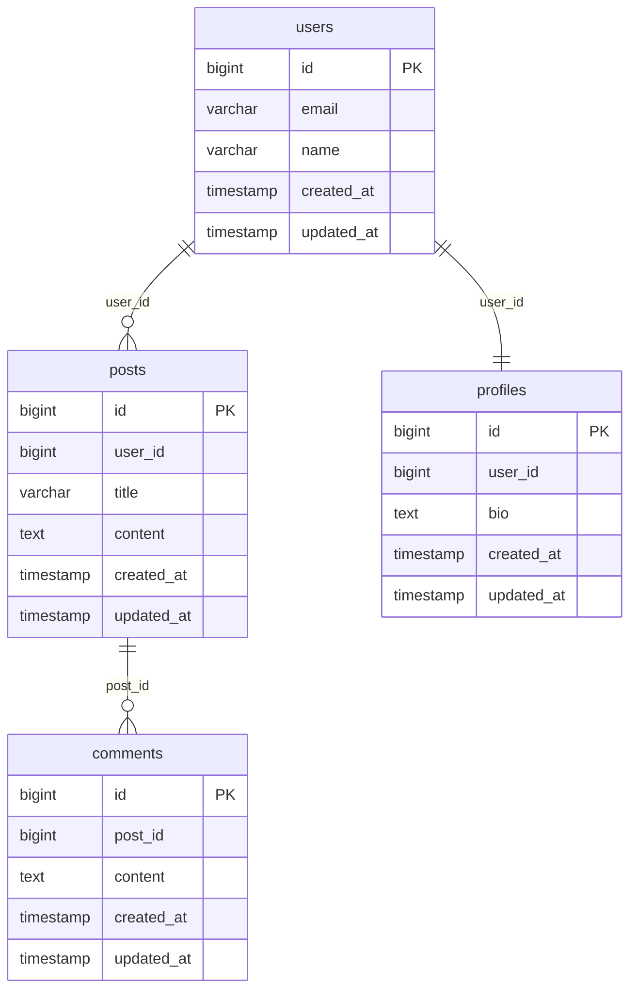

# Rails Mermaid ERD

[](https://badge.fury.io/rb/rails_mermaid_erd)
[](https://github.com/delexw/rails_mermaid_erd/actions)

A Ruby gem that generates [Mermaid.js](https://mermaid.js.org/) Entity Relationship Diagrams (ERD) from ActiveRecord models in Rails applications.

## Features

- 🔍 **ActiveRecord Introspection**: Automatically discovers your Rails models and their relationships
- 📊 **Mermaid ERD Generation**: Outputs clean, readable Mermaid.js ERD syntax
- 🚀 **Simple Integration**: Easy-to-use Rake task for generating diagrams
- 🔗 **Relationship Mapping**: Supports `belongs_to`, `has_one`, `has_many`, and `has_and_belongs_to_many` associations
- 💫 **Polymorphic Support**: Accurately discovers and maps polymorphic relationships

## Installation

Add this line to your application's Gemfile:

```ruby
gem 'rails_mermaid_erd', group: :development
```

And then execute:

```bash
$ bundle install
```

Or install it yourself as:

```bash
$ gem install rails_mermaid_erd
```

## Usage

### Generate ERD with Rake Task

The simplest way to generate your ERD is using the provided Rake task:

```bash
$ bundle exec rails rails_mermaid_erd:generate
```

This will:
1. Analyze all your ActiveRecord models
2. Generate a Mermaid ERD file at `tmp/erd.mmd`
3. Provide instructions on how to view the diagram


### Advanced Usage: Model Data Interface

You can access the collected model and relationship data directly without generating a diagram:

#### Simple Data Collection

```ruby
# Get all collected data in a structured format
data = RailsMermaidErd.build.parsed_data

# Access collected data
models_data = data.models_data                           # Hash of models having table keyed by model name
models = data.models                                     # Array of all loaded models
models_no_tables = data.models_no_tables                 # Array of models missing tables
relationships = data.relationships                       # Array of relationship objects
invalid_associations = data.invalid_associations         # Array of associations missing associated table
polymorphic_associations = data.polymorphic_associations # Array of polymorphic associations
regular_associations = data.regular_associations         # Array of regular (non-polymorphic) associations

```

## Viewing the Generated ERD

Once you have generated the `.mmd` file, you can view it using:

- **Mermaid ERD Visulizer**: https://github.com/delexw/mermaid-erd-visualizer


## Example Output

Given Rails models like:

```ruby
class User < ActiveRecord::Base
  has_many :posts
  has_one :profile
end

class Post < ActiveRecord::Base
  belongs_to :user
  has_many :comments
end

class Comment < ActiveRecord::Base
  belongs_to :post
end

class Profile < ActiveRecord::Base
  belongs_to :user
end
```

The gem will generate:



## Polymorphic Associations

The gem automatically detects and properly maps polymorphic associations in your models. For example:

```ruby
class Comment < ActiveRecord::Base
  belongs_to :commentable, polymorphic: true
end

class Post < ActiveRecord::Base
  has_many :comments, as: :commentable
end

class Photo < ActiveRecord::Base
  has_many :comments, as: :commentable
end
```

The ERD will correctly show relationships between `comments` and both `posts` and `photos` tables.

## Supported ActiveRecord Associations

- **belongs_to**: Generates one-to-many relationships
- **has_one**: Generates one-to-one relationships  
- **has_many**: Covered by the corresponding belongs_to
- **has_and_belongs_to_many**: Generates many-to-many relationships
- **polymorphic**: Discovers and maps all polymorphic interfaces

## Development

After checking out the repo, run `bin/setup` to install dependencies. Then, run `rake spec` to run the tests. You can also run `bin/console` for an interactive prompt that will allow you to experiment.

To install this gem onto your local machine, run `bundle exec rake install`. To release a new version, update the version number in `version.rb`, and then run `bundle exec rake release`, which will create a git tag for the version, push git commits and the created tag, and push the `.gem` file to [rubygems.org](https://rubygems.org).

## Contributing

Bug reports and pull requests are welcome on GitHub at https://github.com/delexw/rails_mermaid_erd.

## License

The gem is available as open source under the terms of the [MIT License](https://opensource.org/licenses/MIT).

## Changelog

See [CHANGELOG.md](CHANGELOG.md) for details about changes in each version. 